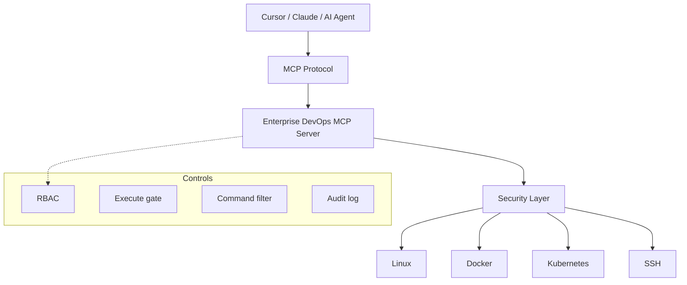

<div align="center">

# Enterprise DevOps MCP Server

**MCP server for governed AI Agent tool calling over Linux, Docker, Kubernetes, and SSH.**

让 AI Agent 在安全边界内做基础设施自动化——而不是拿到不受限的 shell。

[English](README_EN.md) · [Architecture](docs/architecture.md) · [Security](SECURITY.md) · [Contributing](CONTRIBUTING.md)

[]()
[](https://github.com/zhifengjin050-arch/enterprise-devops-mcp-server/actions)
[]()
[](LICENSE)

</div>

> **AI Agent → MCP Protocol → Security Layer → Infrastructure**

---

## Positioning

Enterprise AIOps building block: Cursor / Claude / any MCP client calls **17 tools** through permission control, execute protection, command filtering, and audit logging.

Default posture: **read-only** (`EXECUTE_TOOLS_ENABLED=false`).

---

## Features

| Feature | Status |
|---------|--------|
| Linux monitoring | ✅ |
| Docker management | ✅ |
| Kubernetes read APIs | ✅ |
| SSH automation | ✅ |
| Permission control | ✅ |
| Execute protection | ✅ |
| Audit logging | ✅ |
| Docker Compose deploy | ✅ |
| GitHub Actions CI | ✅ |

---

## MCP tool catalog

| Tool | Category | Risk | Permission |
|------|----------|------|------------|
| `get_server_health` | system | safe | viewer |
| `get_system_info` | system | safe | viewer |
| `get_cpu_usage` | system | safe | viewer |
| `get_memory_usage` | system | safe | viewer |
| `get_disk_usage` | system | safe | viewer |
| `list_processes` | system | safe | viewer |
| `get_audit_logs` | system | moderate | admin |
| `docker_list` | docker | safe | viewer |
| `docker_logs` | docker | safe | viewer |
| `docker_restart` | docker | dangerous | admin |
| `k8s_get_pods` | kubernetes | safe | viewer |
| `k8s_get_deployments` | kubernetes | safe | viewer |
| `k8s_get_services` | kubernetes | safe | viewer |
| `k8s_logs` | kubernetes | safe | viewer |
| `ssh_check_connection` | ssh | safe | viewer |
| `ssh_execute_command` | ssh | dangerous | admin |
| `ssh_upload_file` | ssh | dangerous | admin |

---

## Architecture




---

## Screenshots

| MCP tools | Cursor / Claude |
|-----------|-----------------|
|  |  |

| Architecture |
|--------------|
|  |

Cursor / Claude 图为 **Product Preview**（能力示意）。将本仓库配置进 MCP 后即可在 IDE 中真实调用。

---

## Quick Start

```bash
git clone https://github.com/zhifengjin050-arch/enterprise-devops-mcp-server.git
cd enterprise-devops-mcp-server
cp .env.example .env
pip install -r requirements.txt
python -m app.server
```

### Docker

```bash
docker compose up -d --build
```

### Cursor MCP

```json
{
  "mcpServers": {
    "enterprise-devops": {
      "command": "python",
      "args": ["scripts/run_devops_mcp.py"],
      "cwd": "YOUR_PROJECT_PATH",
      "env": {
        "EXECUTE_TOOLS_ENABLED": "false"
      }
    }
  }
}
```

Example: [mcp_config_examples/cursor_mcp.json](mcp_config_examples/cursor_mcp.json)

```bash
pytest
```

---

## Deployment

| Mode | Command |
|------|---------|
| Local | `python -m app.server` |
| Docker | `docker compose up -d --build` |

Never enable execute tools in production without an explicit change-control process.

---

## Roadmap

**v1.0.x (current):** 17 tools, security layer, audit, Docker, CI.

Later: more cloud providers, finer-grained policy packs, signed audit export.

---

## License

[MIT](LICENSE)

[CONTRIBUTING.md](CONTRIBUTING.md) · [CODE_OF_CONDUCT.md](CODE_OF_CONDUCT.md) · [SECURITY.md](SECURITY.md) · [CHANGELOG.md](CHANGELOG.md)

**Disclaimer:** with execute enabled, this software can change hosts and containers. Validate in non-production first.
