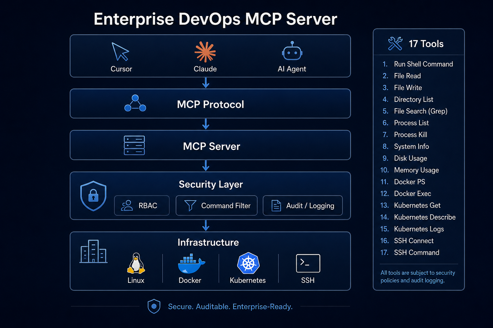
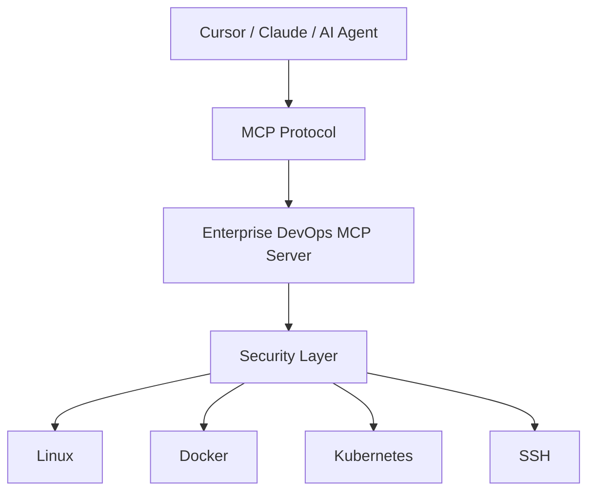
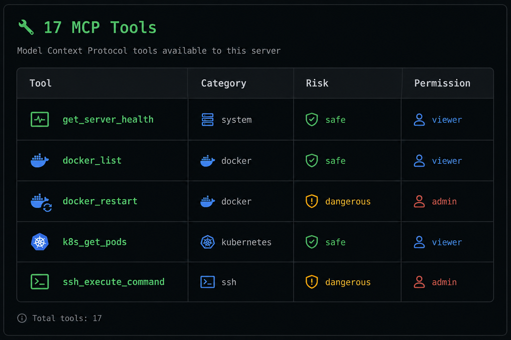
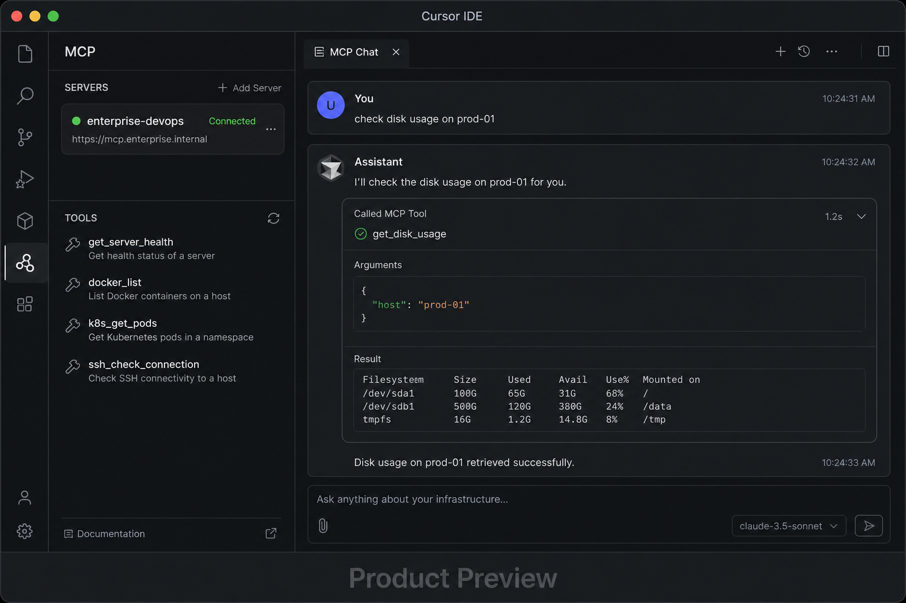

<div align="center">

# Enterprise DevOps MCP Server

**MCP server for governed AI Agent tool calling over Linux, Docker, Kubernetes, and SSH.**

Give agents a path to automate infrastructure — not an unrestricted shell.

[中文](README.md) · [Architecture](docs/architecture.en.md) · [Security](SECURITY.md) · [Contributing](CONTRIBUTING.md)

[]()
[](https://github.com/zhifengjin050-arch/enterprise-devops-mcp-server/actions)
[]()
[](LICENSE)

</div>

> **AI Agent → MCP Protocol → Security Layer → Infrastructure**

---

## Positioning

Enterprise AIOps building block. Cursor, Claude, or any MCP client calls **17 tools** through RBAC, execute protection, command filtering, and audit logging.

Default: **read-only** (`EXECUTE_TOOLS_ENABLED=false`).

---

## Features

Linux monitoring · Docker · Kubernetes reads · SSH · permission control · execute gate · audit · Docker Compose · CI

---

## MCP tool catalog

| Tool | Category | Risk | Permission |
|------|----------|------|------------|
| `get_server_health` | system | safe | viewer |
| `get_system_info` | system | safe | viewer |
| `get_cpu_usage` | system | safe | viewer |
| `get_memory_usage` | system | safe | viewer |
| `get_disk_usage` | system | safe | viewer |
| `list_processes` | system | safe | viewer |
| `get_audit_logs` | system | moderate | admin |
| `docker_list` | docker | safe | viewer |
| `docker_logs` | docker | safe | viewer |
| `docker_restart` | docker | dangerous | admin |
| `k8s_get_pods` | kubernetes | safe | viewer |
| `k8s_get_deployments` | kubernetes | safe | viewer |
| `k8s_get_services` | kubernetes | safe | viewer |
| `k8s_logs` | kubernetes | safe | viewer |
| `ssh_check_connection` | ssh | safe | viewer |
| `ssh_execute_command` | ssh | dangerous | admin |
| `ssh_upload_file` | ssh | dangerous | admin |

---

## Architecture





---

## Screenshots

| MCP tools | Cursor / Claude |
|-----------|-----------------|
|  |  |

| Architecture |
|--------------|
|  |

The Cursor / Claude image is a **product preview**. Wire this repo into MCP to call tools from the IDE.

---

## Quick Start

```bash
git clone https://github.com/zhifengjin050-arch/enterprise-devops-mcp-server.git
cd enterprise-devops-mcp-server
cp .env.example .env
pip install -r requirements.txt
python -m app.server
```

```bash
docker compose up -d --build
pytest
```

Cursor snippet: [mcp_config_examples/cursor_mcp.json](mcp_config_examples/cursor_mcp.json)

---

## Deployment

Local: `python -m app.server`  
Docker: `docker compose up -d --build`

Do not enable execute tools in production without change control.

---

## Roadmap

**v1.0.x (current):** 17 tools, security layer, audit, Docker, CI.

Later: more clouds, policy packs, signed audit export.

---

## License

[MIT](LICENSE) · [CONTRIBUTING.md](CONTRIBUTING.md) · [CODE_OF_CONDUCT.md](CODE_OF_CONDUCT.md) · [SECURITY.md](SECURITY.md) · [CHANGELOG.md](CHANGELOG.md)
