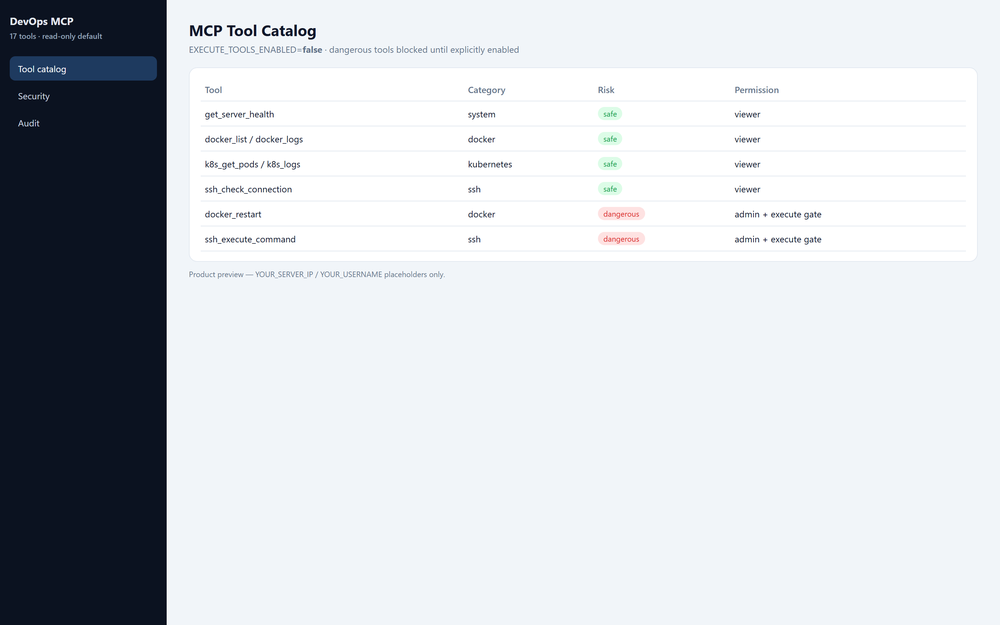
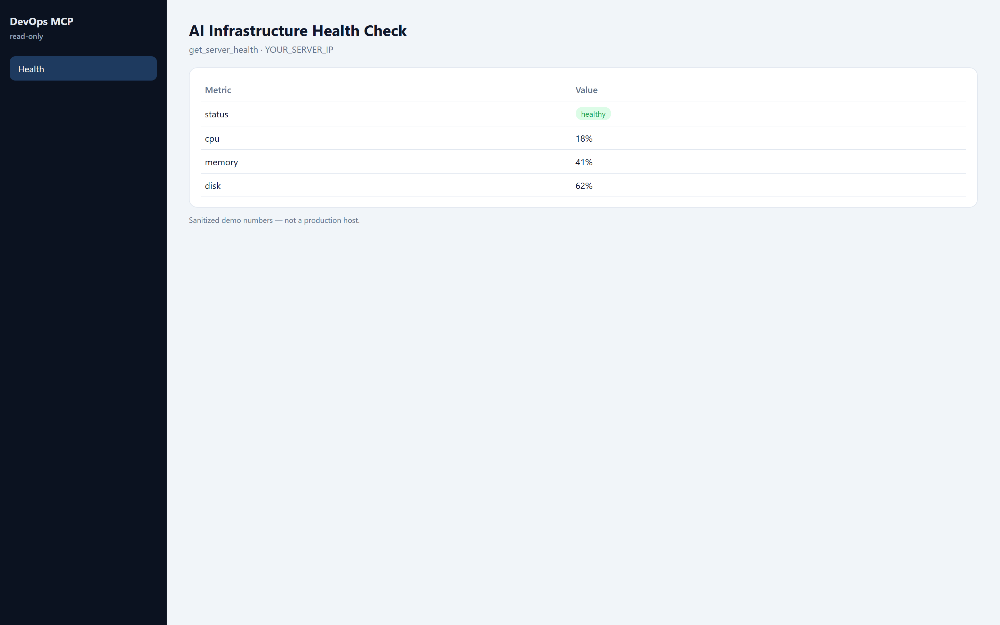
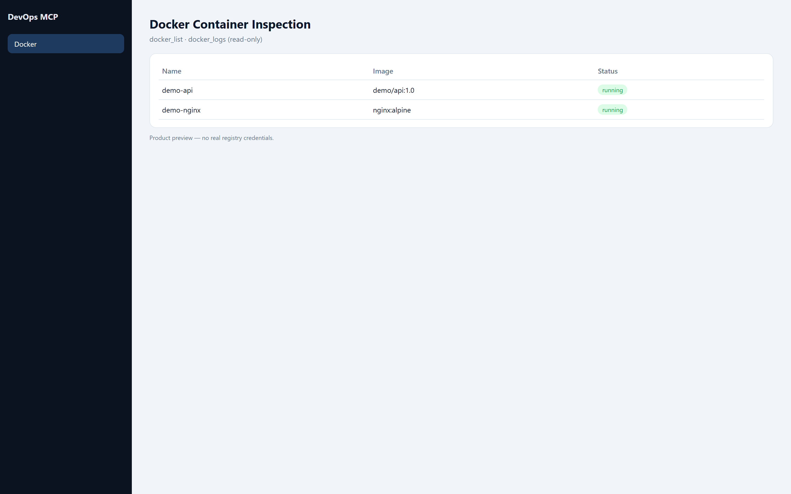
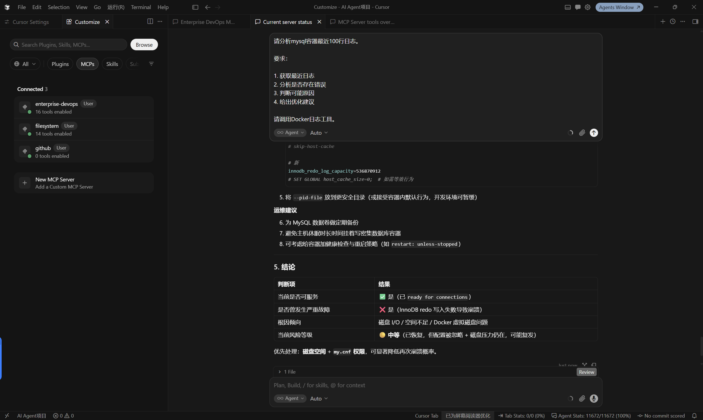
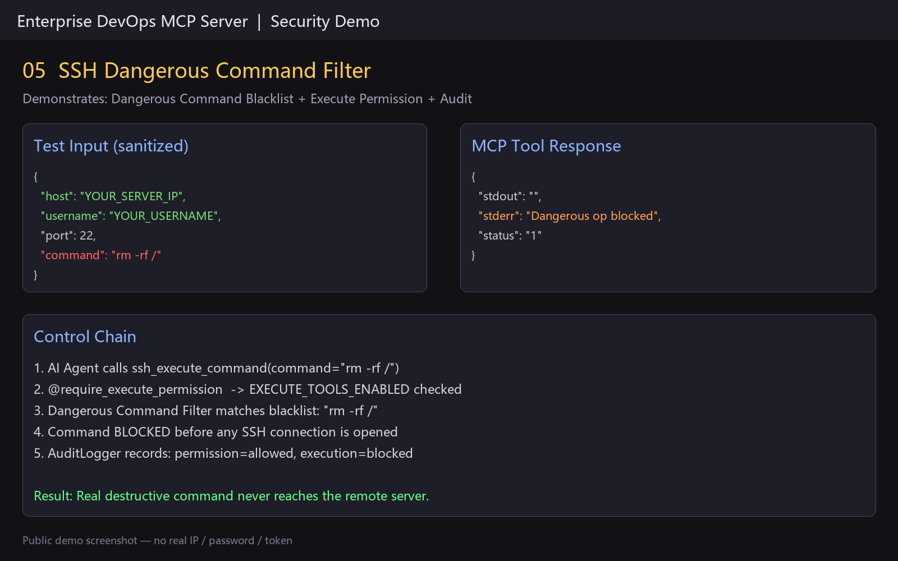
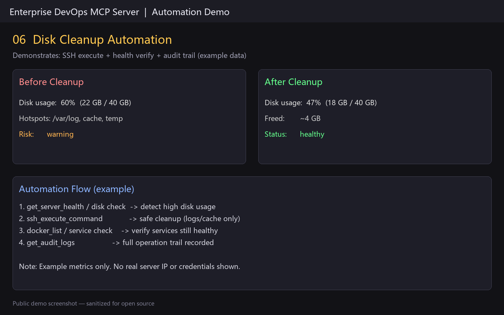

# Screenshots

Public, sanitized acceptance screenshots for the GitHub README.

## Screenshots Index

1. **MCP Server Connection** — `01-mcp-connection-tools.png`
2. **AI Infrastructure Health Check** — `02-server-health-check.png`
3. **Docker Container Inspection** — `03-docker-inspection.png`
4. **MySQL Log Analysis** — `04-mysql-log-analysis.png`
5. **SSH Security Filter** — `05-ssh-dangerous-command-filter.png`
6. **Disk Cleanup Automation** — `06-disk-cleanup-automation.png`

## Preview

### 1. MCP Server Connection

### 2. AI Infrastructure Health Check

### 3. Docker Container Inspection

### 4. MySQL Log Analysis

### 5. SSH Security Filter

### 6. Disk Cleanup Automation

## Notes

- Files under `验收截图/` are **gitignored** (may contain real hosts).
- Public images must not include real passwords, API keys, tokens, or private keys.
- Prefer placeholders: `YOUR_SERVER_IP`, `YOUR_USERNAME`.
